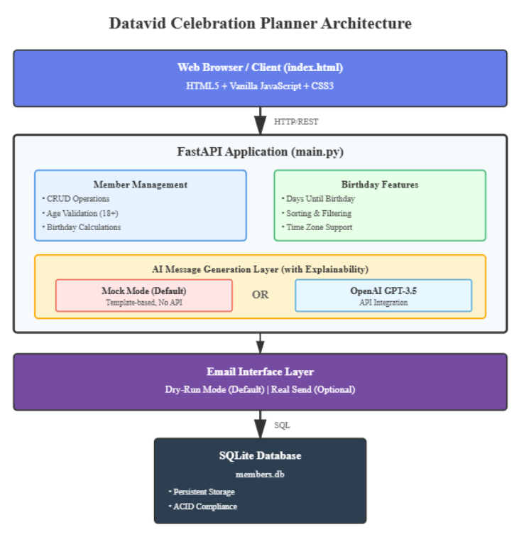

# Datavid Celebration Planner

A birthday management system with AI-powered personal message generation, time zone support, and explainable AI capabilities. Built with Python/FastAPI and a modern web interface.

## Architecture Overview

The application follows a layered architecture with clear separation of concerns:

**Presentation Layer**: Modern web UI (HTML/CSS/JavaScript) providing intuitive member management and message generation interface.

**API Layer**: FastAPI REST endpoints handling CRUD operations, birthday calculations, and AI message generation with comprehensive validation.

**Business Logic Layer**: Core functions for birthday calculations (with year rollover), AI message generation (mock and OpenAI modes), and email interface with dry-run capability.

**Data Layer**: SQLite database with persistent storage, automatic schema creation, and seed data initialization.

**AI Layer**: Pluggable design supporting both mock mode (template-based, no API keys) and OpenAI GPT-3.5 integration with full explainability.



## Data Model

```sql
CREATE TABLE members (
    id INTEGER PRIMARY KEY AUTOINCREMENT,
    first_name TEXT NOT NULL,
    last_name TEXT NOT NULL,
    birth_date TEXT NOT NULL,        -- YYYY-MM-DD format
    country TEXT NOT NULL,
    city TEXT NOT NULL,
    created_at TEXT NOT NULL,
    UNIQUE(first_name, last_name, country, city)
)
```

**Business Rules**:
- All fields mandatory
- Members must be 18+ years old
- Unique constraint on (first_name, last_name, country, city) tuple
- Birth dates in ISO format (YYYY-MM-DD)
- Time zones calculated from country mapping

## Interface Choice

**Web UI + REST API**: Provides the best user experience with visual feedback while maintaining API accessibility for testing and automation. The web interface automatically refreshes data, displays validation errors inline, and provides interactive filtering and sorting. API endpoints are fully documented at `/docs` (FastAPI auto-generated OpenAPI).

**Key Endpoints**:
- `POST /members` - Add new member
- `GET /members?sort_by_birthday=true&upcoming_only=true` - List/filter members
- `POST /members/{id}/birthday-message?tone=friendly` - Generate AI message
- `POST /members/{id}/send-email?dry_run=true` - Send email (dry-run default)

## AI Choice and Explainability

**Dual-Mode Design**:

**Mock Mode (Default)**: Template-based generation requiring no API keys or network access. Ideal for testing and demonstration. Provides complete explainability showing the template approach.

**OpenAI Mode (Optional)**: GPT-3.5-turbo integration with temperature 0.7 for creative variation. Activated by setting `MOCK_AI=false` and providing API key.

**Explainability Output**:
```json
{
  "message": "Generated birthday message...",
  "explanation": {
    "model": "mock-generator-v1",
    "method": "template_based_generation",
    "parameters": {"tone": "friendly", "language": "en"},
    "rationale": "Generated using rule-based template with friendly tone. Personalized with member's name and cultural context from USA."
  }
}
```

All messages include model name, method, key parameters, and a two-sentence rationale. No chain-of-thought reasoning is exposed.

## Quick Start (3 Commands)

```bash
# 1. Install dependencies
pip install -r requirements.txt

# 2. Run application
python main.py

# 3. Open browser
# Navigate to http://localhost:8000
```

The application auto-initializes the database and seeds 6 sample members across different time zones (USA, UK, Germany, Japan, Canada, India).

## Configuration

**Environment Variables** (optional):
```bash
export MOCK_AI=true              # Use mock AI (default: true)
export OPENAI_API_KEY=sk-xxx...  # OpenAI key (only if MOCK_AI=false)
export DB_PATH=members.db        # Database file path
```

**Or use `.env` file**: Copy `.env.example` to `.env` and modify values.

**Mock Mode (Default)**: Works immediately with no configuration.

**OpenAI Mode**: Requires API key from https://platform.openai.com/api-keys

## Testing

**Automated Tests** (12 tests covering all requirements):
```bash
pytest test_app.py -v
```

**Manual Test Flow** (5 minutes):

1. **View Members**: Open http://localhost:8000 - see 6 seeded members
2. **Sort by Birthday**: Click "Sort by Birthday" button - members reorder by closest birthday
3. **Filter Upcoming**: Click "Next 30 Days" - shows only upcoming birthdays
4. **Add Member**: Fill form with valid data (18+ years old) - member added successfully
5. **Validate Age**: Try adding someone born in 2010 - see validation error
6. **Validate Duplicate**: Try adding "John Smith" in "New York, USA" - see duplicate error
7. **Generate AI Message (Friendly)**: Click button for any member - see personalized message
8. **View Explainability**: Check explanation box showing model, parameters, and rationale
9. **Generate AI Message (Formal)**: Click button with formal tone - see different message style
10. **Email Dry-Run**: Click "Send Email" - see email preview without actual sending

**API Testing with curl**:
```bash
# List all members sorted by birthday
curl http://localhost:8000/members?sort_by_birthday=true

# Generate friendly message for member ID 1
curl -X POST "http://localhost:8000/members/1/birthday-message?tone=friendly"

# Add new member
curl -X POST http://localhost:8000/members \
  -H "Content-Type: application/json" \
  -d '{"first_name":"Alice","last_name":"Brown","birth_date":"1992-06-15","country":"Australia","city":"Sydney"}'
```

## Sample Data

The application seeds 6 members automatically on startup:

| Name | Birth Date | Country | City | Time Zone |
|------|------------|---------|------|-----------|
| John Smith | 1990-03-15 | USA | New York | EST (UTC-5) |
| Emma Johnson | 1985-07-22 | UK | London | GMT (UTC+0) |
| Hans Mueller | 1992-11-08 | Germany | Berlin | CET (UTC+1) |
| Yuki Tanaka | 1988-01-30 | Japan | Tokyo | JST (UTC+9) |
| Sophie Martin | 1995-05-12 | Canada | Toronto | EST (UTC-5) |
| Raj Patel | 1987-09-25 | India | Mumbai | IST (UTC+5:30) |

This data allows reviewers to immediately test sorting by upcoming birthdays and filtering by 30-day windows.

## Key Features

 **Validation**: Age 18+, unique tuple constraint, required fields, date format
 **Birthday Logic**: Correct year rollover, days until calculation, time zone awareness
 **Sorting**: Closest upcoming birthdays first with proper handling of past birthdays
 **Filtering**: Next 30 days view for planning celebrations
 **AI Messages**: Personalized messages with tone parameter (friendly/formal)
 **Explainability**: Complete transparency with model, method, parameters, and rationale
 **Mock Mode**: No API keys or network required for testing
 **Email Interface**: Dry-run mode prevents accidental sends
 **Error Handling**: Clear messages with appropriate HTTP status codes (201, 400, 404, 422)

## Technology Stack

- **Backend**: Python 3.8+, FastAPI (modern async framework)
- **Database**: SQLite (zero-config, file-based)
- **AI**: OpenAI GPT-3.5-turbo (optional) or Mock templates (default)
- **Frontend**: Vanilla HTML/CSS/JavaScript (no framework dependencies)
- **Testing**: pytest with FastAPI TestClient

## Project Structure

```
├── main.py              # Core application (API + business logic)
├── index.html           # Web UI
├── test_app.py          # Automated test suite
├── requirements.txt     # Python dependencies
├── architecture.svg     # System architecture diagram
├── .env.example         # Configuration template with redacted secrets
├── README.md            # This file
└── members.db           # SQLite database (auto-created)
```

## Optional: Docker

```bash
docker build -t birthday-planner .
docker run -p 8000:8000 birthday-planner
```

## Support

For issues or questions, check:
- API documentation: http://localhost:8000/docs (auto-generated OpenAPI)
- Test output: `pytest test_app.py -v` for comprehensive validation
- All endpoints return JSON errors with clear messages on validation failures
